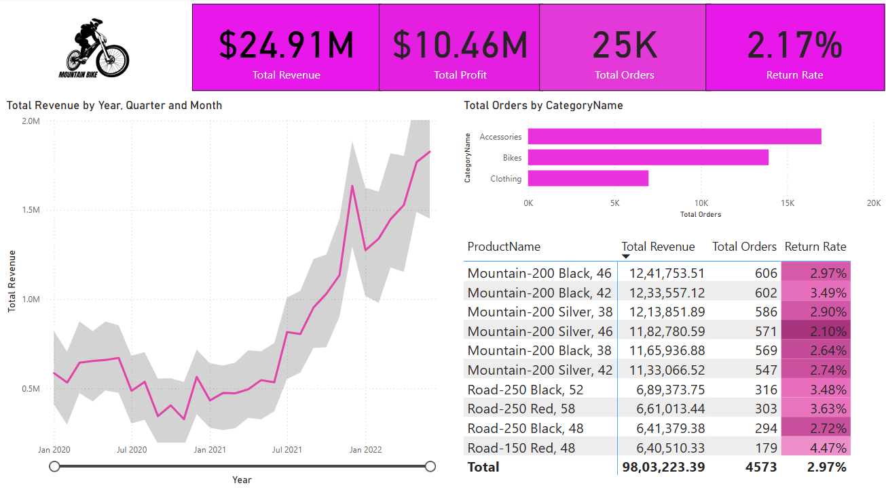

# Adventure_Works_Analysis

## Overview 
The Adventures Works Project is a Power BI data analysis project that provides insights into total revenue, profit, orders, and return rates for various products and categories. The analysis visualizes trends by year, quarter, and month, offering a comprehensive understanding of sales performance.

## Key Metrics
1.Total Revenue: $24.91M

2.Total Profit: $10.46M

3.Total Orders: 25K

4.Return Rate: 2.17%

## Data Insights

## Revenue Trends
1.Revenue is analyzed over time by year, quarter, and month.

2.Visualization of revenue performance across different periods helps identify trends.

## Product Performance
1.Top-selling products include Mountain-200 and Road-250 models.

2.Revenue, total orders, and return rates are calculated per product.

3.The highest return rate among the top products is 4.47% for the Road-150 Red, 48 model.

## Category Analysis
1.Orders are categorized into Accessories, Bikes, and Clothing.

2.The number of total orders per category is visualized to assess sales distribution.

## Geographic Analysis
1.Sales performance is analyzed by continent.

2.The data includes filtering options for Europe, North America, and Pacific.

## Tools Used
1.Power BI Desktop for data visualization and analysis.

2.Data mapping with Bing Maps for geographical insights.

## Future Enhancement
1.Integration with live data sources for real-time analysis.

2.Advanced predictive analytics using machine learning.

3.Customizable dashboard layouts based on user preferences.

4.Automated email reporting for key stakeholders.
